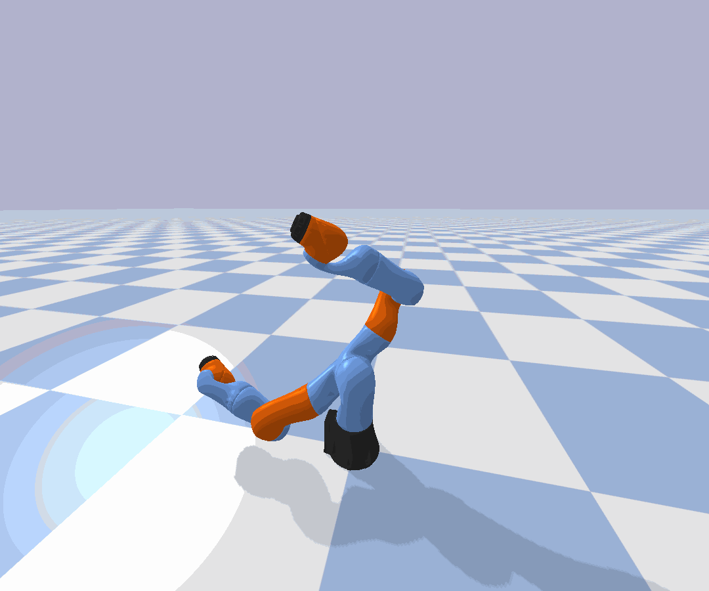

# PyBullet-Kuka

A Kuka arm is dancing with a determined trajectory.

 

## Installation

```bash
git clone https://github.com/rainorangelemon/Pybullet-Kuka
cd Pybullet-Kuka
# for conda users
conda create -n kuka python=3.8
conda activate kuka
pip install -r requirements.txt
```

## Codes

kuka_env.py
- includes a kuka iiwa arm, with collision checking and sampling functions

play.py

- set `GUI=True` for visualization
- set `make_gif=True` to save the trajectory as `kuka.gif`

## Contact

Chenning Yu, <a href="mailto:chy010@ucsd.edu">chy010@ucsd.edu</a>

## Acknowledgement

The Kuka arm is based on PyBullet: [https://github.com/bulletphysics/bullet3/blob/master/examples/pybullet/gym/pybullet_envs/bullet/kukaGymEnv.py](https://github.com/bulletphysics/bullet3/blob/master/examples/pybullet/gym/pybullet_envs/bullet/kukaGymEnv.py).
